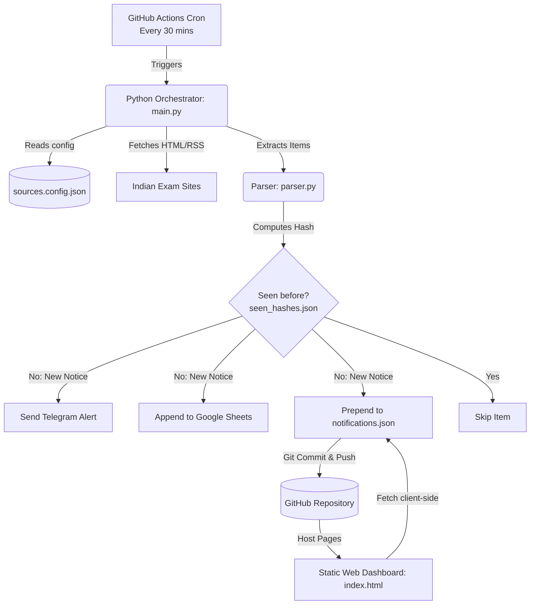

# 📝 Project Context: India Exam Tracker

This document provides a comprehensive technical overview and context for the **India Exam Tracker** codebase. It acts as the single source of truth for understanding the architecture, data contracts, and integration flows. Update this document whenever changes are made to the codebase architecture or data pipelines.

---

## 🧭 Table of Contents
1. [System Architecture Overview](#-system-architecture-overview)
2. [File Directory Structure](#-file-directory-structure)
3. [Data Contracts & Schemas](#-data-contracts--schemas)
4. [Component Walkthrough](#-component-walkthrough)
5. [GitHub Actions Workflow](#-github-actions-workflow)
6. [Secrets Checklist](#-secrets-checklist)
7. [Deduplication & Error Fallbacks](#-deduplication--error-fallbacks)
8. [Runbook & Troubleshooting](#-runbook--troubleshooting)

---

## 🏗️ System Architecture Overview

The system is designed as a **serverless, free-tier-optimized pipeline** that scrapes websites, alerts users, updates databases, and hosts a dashboard without any running infrastructure costs.



### Flow Details:
1. **Orchestrator**: GitHub Actions triggers the scraper at configured cron intervals (currently every 30 minutes in [scrape.yml](file:///e:/Coding/Projects/Notification Dashboard/.github/workflows/scrape.yml)).
2. **Scraper**: [main.py](file:///e:/Coding/Projects/Notification Dashboard/scraper/main.py) reads the configured exam URLs from [sources.config.json](file:///e:/Coding/Projects/Notification Dashboard/sources.config.json), fetches content using [fetcher.py](file:///e:/Coding/Projects/Notification Dashboard/scraper/fetcher.py), and parses the data using [parser.py](file:///e:/Coding/Projects/Notification Dashboard/scraper/parser.py).
3. **De-duplication**: Items are checked against [seen_hashes.json](file:///e:/Coding/Projects/Notification Dashboard/data/seen_hashes.json). New items generate alerts and updates.
4. **Notifier Integration**: Alerts are pushed to the user via [telegram_bot.py](file:///e:/Coding/Projects/Notification Dashboard/notifier/telegram_bot.py) and logged to a Google Sheets workbook using [sheets_logger.py](file:///e:/Coding/Projects/Notification Dashboard/notifier/sheets_logger.py).
5. **Data Storage & Deployment**: The orchestrator saves the modified data files in the repo and commits the changes back to GitHub.
6. **Frontend**: GitHub Pages hosts [index.html](file:///e:/Coding/Projects/Notification Dashboard/index.html), which loads [notifications.json](file:///e:/Coding/Projects/Notification Dashboard/data/notifications.json) client-side to render a reactive Tailwind dashboard.

---

## 📂 File Directory Structure

- [sources.config.json](file:///e:/Coding/Projects/Notification Dashboard/sources.config.json): Registry of active exam web pages, RSS feeds, and scrapers configurations.
- [index.html](file:///e:/Coding/Projects/Notification Dashboard/index.html): The static web dashboard hosted on GitHub Pages.
- [scraper/](file:///e:/Coding/Projects/Notification Dashboard/scraper):
  - [main.py](file:///e:/Coding/Projects/Notification Dashboard/scraper/main.py): Scraper engine orchestration, deduplication logic, and lifecycle control.
  - [fetcher.py](file:///e:/Coding/Projects/Notification Dashboard/scraper/fetcher.py): Networking component. Sets headers, retries with backoffs, and performs XML (RSS) or HTML fetches.
  - [parser.py](file:///e:/Coding/Projects/Notification Dashboard/scraper/parser.py): Selects anchor elements, normalizes links, strips whitespace and common tag badges ("new", "updated").
  - [requirements.txt](file:///e:/Coding/Projects/Notification Dashboard/scraper/requirements.txt): Python package requirements (e.g. `requests`, `beautifulsoup4`, `feedparser`, `google-api-python-client`).
- [notifier/](file:///e:/Coding/Projects/Notification Dashboard/notifier):
  - [telegram_bot.py](file:///e:/Coding/Projects/Notification Dashboard/notifier/telegram_bot.py): Formats notices and publishes notifications through the Telegram Bot API.
  - [sheets_logger.py](file:///e:/Coding/Projects/Notification Dashboard/notifier/sheets_logger.py): Logs metadata to a Google Sheets document via GCP Service Account.
- [data/](file:///e:/Coding/Projects/Notification Dashboard/data):
  - [notifications.json](file:///e:/Coding/Projects/Notification Dashboard/data/notifications.json): Flat database storing parsed notification objects (capped at 500 items).
  - [seen_hashes.json](file:///e:/Coding/Projects/Notification Dashboard/data/seen_hashes.json): Array of MD5 hashes used for message deduplication.
- [.github/workflows/](file:///e:/Coding/Projects/Notification Dashboard/.github/workflows):
  - [scrape.yml](file:///e:/Coding/Projects/Notification Dashboard/.github/workflows/scrape.yml): Continuous integration pipeline executing the scrape cycle and pushing updates.

---

## 📄 Data Contracts & Schemas

### 1. `notifications.json` Schema
Stored in [notifications.json](file:///e:/Coding/Projects/Notification Dashboard/data/notifications.json). Contains an array of notification items in the following format:
```json
{
  "id": "7b09ca6bc80d3215281bbcfc27303c73",
  "title": "Registration for JEE Main 2026 Session 1 is Live",
  "url": "https://jeemain.nta.ac.in/Download/Notice/notice_20260101.pdf",
  "exam": "JEE Mains",
  "exam_id": "jee_mains",
  "category": "Engineering Entrance",
  "source_label": "NTA Official Website",
  "source_url": "https://nta.ac.in/",
  "fetched_at": "2026-05-24T15:47:43+00:00"
}
```

### 2. `sources.config.json` Schema
Stored in [sources.config.json](file:///e:/Coding/Projects/Notification Dashboard/sources.config.json). Configures URLs and selectors for parsing.
- **`sources`**: A list of exam metadata.
- **`settings`**: Scraper scheduling/capping settings.

#### Source Configuration Options:
*   **HTML Scrape / RSS**: Configured via `"fetch_type": "html_scrape"` or `"rss"`. Uses `"selector"` (CSS Selector).
*   **JSON API Scrape**: Configured via `"fetch_type": "json"`. Uses `"json_selector"` (dot-path to notice array), `"title_key"` (dot-path to title), and `"url_key"` (dot-path to link).
```json
{
  "sources": [
    {
      "id": "jee_mains",
      "name": "JEE Mains",
      "category": "Engineering Entrance",
      "active": true,
      "sources": [
        {
          "label": "NTA Official Website",
          "url": "https://nta.ac.in/",
          "fetch_type": "html_scrape",
          "selector": "a[href*='/Download/Notice/']",
          "base_url": "https://nta.ac.in"
        }
      ]
    }
  ],
  "settings": {
    "check_interval_minutes": 30,
    "max_notifications_per_source": 10,
    "notify_on_new_only": true,
    "dedup_window_days": 30
  }
}
```

### 3. Google Sheets Columns
Created and appended in [sheets_logger.py](file:///e:/Coding/Projects/Notification Dashboard/notifier/sheets_logger.py):
1. **Date & Time** (formatted as `YYYY-MM-DD HH:MM UTC`)
2. **Exam** (e.g. `JEE Mains`)
3. **Category** (e.g. `Engineering Entrance`)
4. **Notification Title** (Cleaned text description)
5. **Source Name** (e.g. `NTA Official Website`)
6. **Source URL** (e.g. `https://nta.ac.in/`)
7. **Direct Link** (The URL containing the actual notice or document link)

---

## ⚙️ Component Walkthrough

### 1. The Scraper Core
- **[scraper/main.py](file:///e:/Coding/Projects/Notification Dashboard/scraper/main.py)**:
  - Invokes `load_config()`, `load_existing_data()`, and `load_seen_hashes()`.
  - Loops over active sources. For each source, it parses notifications using `parse_notifications` from [parser.py](file:///e:/Coding/Projects/Notification Dashboard/scraper/parser.py).
  - Matches notice IDs with `seen_hashes.json`. Unseen items generate alerts using `send_telegram_alert` and `log_to_sheets`.
  - Keeps only the 500 newest records to maintain a lightweight JSON flat file database.

- **[scraper/fetcher.py](file:///e:/Coding/Projects/Notification Dashboard/scraper/fetcher.py)**:
  - Configures standard web browser headers to bypass rudimentary bot blocklists.
  - Implements `urllib3`'s `Retry` handler for resilient HTTP connections, supporting automatic 3-retry strategies with exponential backoffs.
  - Provides `fetch_source(url, fetch_type)`: parses RSS using `feedparser`, fetches HTML text using `requests`, or returns parsed JSON lists/dicts.
  - Automatically handles SSL handshake failures (`SSLError`) by retrying with SSL verification disabled (`verify=False`).

- **[scraper/parser.py](file:///e:/Coding/Projects/Notification Dashboard/scraper/parser.py)**:
  - Supports routing for HTML scraping, RSS parsing, and JSON API payloads.
  - Uses `BeautifulSoup` to process HTML content using the configured CSS selectors.
  - Implements `_resolve_json_path` for JSON data, extracting data points via nested dot-notation paths.
  - Normalizes relative links using the `base_url` defined inside the source settings.
  - Features a smart title resolver `_resolve_generic_title` that extracts text from sibling columns or parent heading nodes when anchor link texts are generic (like "View Document", "View Announcement", "Download", etc.).
  - Includes a text cleanup function `_clean_text()` that strips excessive whitespace and removes noisy starting badge labels like "New", "Updated", "Hot", or "Important".

### 2. Notifiers & Alerts
- **[notifier/telegram_bot.py](file:///e:/Coding/Projects/Notification Dashboard/notifier/telegram_bot.py)**:
  - Authenticates using `TELEGRAM_BOT_TOKEN`.
  - Pushes markdown-formatted chat notifications to the specified `TELEGRAM_CHAT_ID`.
  - Escapes Markdown control symbols (`_`, `*`, `` ` ``) with backslashes using `_escape_md()` to prevent broken formatting outputs.

- **[notifier/sheets_logger.py](file:///e:/Coding/Projects/Notification Dashboard/notifier/sheets_logger.py)**:
  - Connects using a Google Cloud Service Account JSON Key stored in the `GOOGLE_SERVICE_ACCOUNT_JSON` environment variable.
  - Automatically verifies and creates the `"Notifications"` tab if it does not exist in the workbook to prevent range errors.
  - Writes a header row if the sheet is empty, then appends new notification rows using Google Sheets API `append()` requests.
  - Implements custom troubleshooting hints for Google API errors (e.g. printing the exact service account email to share the sheet with on `403 Permission Denied`).

### 3. Frontend Dashboard
- **[index.html](file:///e:/Coding/Projects/Notification Dashboard/index.html)**:
  - Static Single Page Application styled using Tailwind CSS via CDN.
  - Loads [notifications.json](file:///e:/Coding/Projects/Notification Dashboard/data/notifications.json) asynchronously client-side.
  - Generates exam badges dynamically using a predefined color map `EXAM_COLORS`.
  - Provides filtering by category (e.g. National, State/Private, Counselling) and specific exam ID.
  - Includes a custom "🆕 New" badge highlighted for items added within the last 6 hours.
  - Triggers client-side state reloads every 10 minutes.

---

## 🚀 GitHub Actions Workflow

Managed by [.github/workflows/scrape.yml](file:///e:/Coding/Projects/Notification Dashboard/.github/workflows/scrape.yml):
- **Schedule**: Triggers automatically on a `cron` schedule (currently set to every 30 minutes: `*/30 * * * *`).
- **Manual Trigger**: Supports `workflow_dispatch` for manual debugging or updates.
- **Environment**:
  - Python version: `3.11`
  - Secrets injected directly into run-time variables.
  - Adds environment path context variable `PYTHONPATH: .` to ensure python imports work correctly.
- **Git Pushback**: Checks for differences in the generated [data/notifications.json](file:///e:/Coding/Projects/Notification Dashboard/data/notifications.json) or [data/seen_hashes.json](file:///e:/Coding/Projects/Notification Dashboard/data/seen_hashes.json). If changes are detected, it commits and pushes updates back to the repo under the username `exam-tracker-bot`.

---

## 🔑 Secrets Checklist

To allow the workflow to run properly, configure these repository secrets under **Settings** -> **Secrets and variables** -> **Actions**:

| Secret Key | Description / Source |
|---|---|
| `TELEGRAM_BOT_TOKEN` | Bot API Token generated by chatting with `@BotFather`. |
| `TELEGRAM_CHAT_ID` | Numeric Chat identifier. Extractable via `api.telegram.org/bot<TOKEN>/getUpdates`. |
| `GOOGLE_SERVICE_ACCOUNT_JSON` | Full credentials JSON key downloaded from the GCP Service Account panel. |
| `GOOGLE_SHEET_ID` | Spreadsheet string ID extracted directly from the target Sheet URL. |

---

## 🛡️ Deduplication & Error Fallbacks

### Deduplication Logic
Each notification item generates a unique MD5 key by hashing the lowercase string combination:
```python
make_hash(title, url) -> md5(f"{title.strip().lower()}|{url.strip().lower()}")
```
This MD5 signature is appended to [seen_hashes.json](file:///e:/Coding/Projects/Notification Dashboard/data/seen_hashes.json) and prevents the system from generating duplicate Telegram pings and Google Sheet rows when the scheduler reruns.

### Error Handling Principles
- **Per-source boundaries**: Failures inside one site's parser or request handler do not interrupt the scraping of other exam sources.
- **Integration resilience**: Failure to dispatch Telegram notifications or append Google Sheet rows is caught and logged, allowing execution to continue.
- **HTTP delays**: Includes a 1-second polite sleep (`time.sleep(1)`) between requests to avoid overloading target servers.

---

## 🛠️ Runbook & Troubleshooting

### Adding a New Exam
1. Open [sources.config.json](file:///e:/Coding/Projects/Notification Dashboard/sources.config.json).
2. Append a new object inside the `"sources"` array. Follow this template:
   ```json
   {
     "id": "new_exam_id",
     "name": "New Exam Display Name",
     "category": "Engineering Entrance",
     "active": true,
     "sources": [
       {
         "label": "Official Website",
         "url": "https://examweb.gov.in/",
         "fetch_type": "html_scrape",
         "selector": "a[href*='.pdf']",
         "base_url": "https://examweb.gov.in"
       }
     ]
   }
   ```
3. Open [index.html](file:///e:/Coding/Projects/Notification Dashboard/index.html) and locate the filters area (lines 41-77). Add a matching filter button inside the appropriate category section:
   ```html
   <button onclick="filterExam('new_exam_id')" id="btn-new_exam_id" class="filter-btn px-3 py-1 rounded-full text-sm font-medium bg-gray-100 text-gray-700 hover:bg-blue-100 transition">New Exam Display Name</button>
   ```
4. Define a custom color scheme inside the JS mapping `EXAM_COLORS` inside [index.html](file:///e:/Coding/Projects/Notification Dashboard/index.html#L120-L144).

### Local Testing Checklist
Ensure environment variables are loaded (or write a temporary `.env` file):
```bash
# Clone the repository
git clone https://github.com/proharshgrammer/exam-notifier.git
cd exam-notifier

# Install dependencies
pip install -r scraper/requirements.txt

# Run the entry point script
python scraper/main.py
```
Open [index.html](file:///e:/Coding/Projects/Notification Dashboard/index.html) in your browser to verify dashboard rendering using local files.
